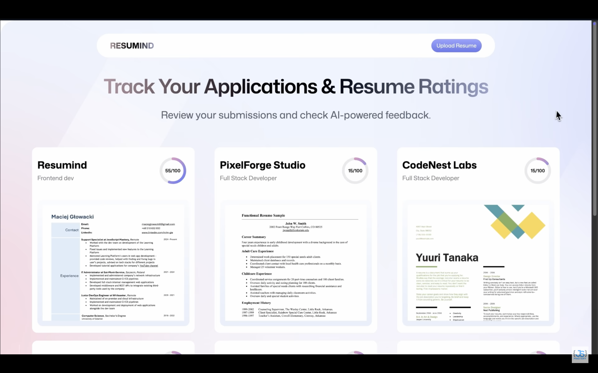
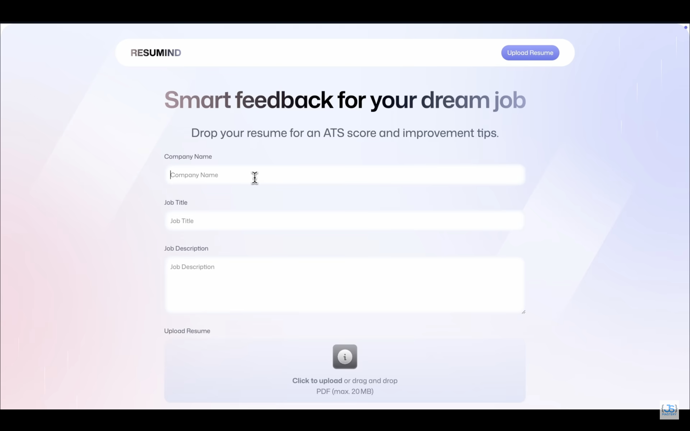
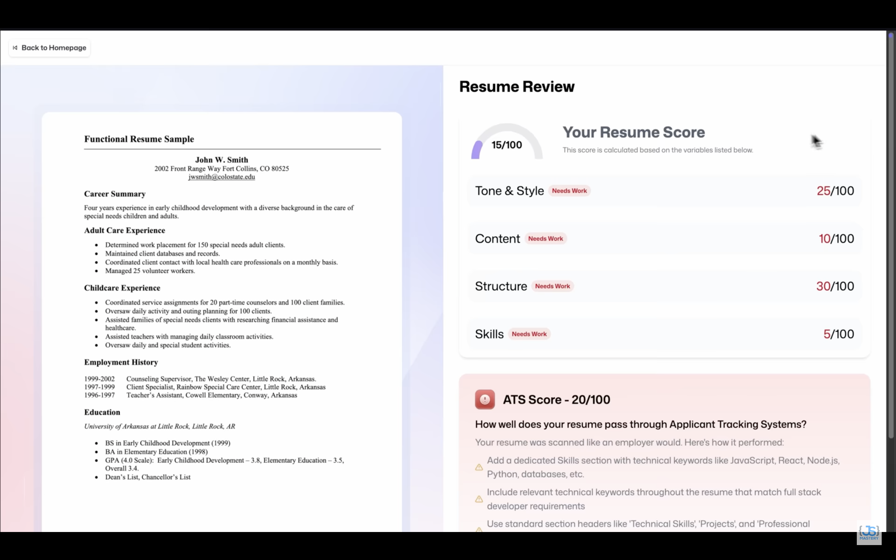

<div align="center">
  <div>
    
    
    
    
    
    
  </div>

  <h1 align="center">🚀 AI Resume Analyzer</h1>
  <h3 align="center">Smart AI-powered feedback for your dream job applications</h3>

  <p align="center">
    <strong>Upload your resume, get detailed AI analysis, and improve your chances of landing your dream job!</strong>
  </p>

   <div align="center">
     Built step by step with detailed tutorial on <b>JavaScript Mastery</b> YouTube.
    </div>
</div>

---

## 📋 <a name="table">Table of Contents</a>

1. [✨ Introduction](#introduction)
2. [🎯 Features](#features)
3. [⚙️ Tech Stack](#tech-stack)
4. [🏗️ Architecture](#architecture)
5. [🚀 Quick Start](#quick-start)
6. [🔧 Configuration](#configuration)
7. [📱 Usage](#usage)
8. [🐳 Docker Deployment](#docker)
9. [🤝 Contributing](#contributing)
10. [📄 License](#license)
11. [🔗 Resources](#resources)

---

## <a name="introduction">✨ Introduction</a>

**AI Resume Analyzer** is a powerful, modern web application that leverages artificial intelligence to provide comprehensive resume analysis and feedback. Built with React, TypeScript, and Puter.js, this application helps job seekers optimize their resumes for Applicant Tracking Systems (ATS) and improve their overall presentation.

<div align="center">
  
  <p><em>Clean, modern dashboard showing all your analyzed resumes</em></p>
</div>

### Why AI Resume Analyzer?

- **🎯 ATS Optimization**: Get detailed ATS compatibility scores and recommendations
- **🔍 Comprehensive Analysis**: Analyze content, structure, tone, style, and skills
- **🤖 AI-Powered Feedback**: Leverages advanced AI models for intelligent suggestions  
- **📊 Visual Scoring**: Beautiful visual representations of your resume performance
- **☁️ Cloud Storage**: Secure resume storage and management with Puter.js
- **🚫 No Backend Required**: Fully client-side application with serverless architecture

---

## <a name="features">🎯 Features</a>

### 🔐 **Authentication & Security**
- **Browser-based Authentication**: Seamless auth using Puter.js with no backend setup
- **Secure File Storage**: All resumes stored securely in your personal cloud space
- **Privacy First**: Your data stays private and secure

### 📄 **Resume Management**
- **PDF Upload Support**: Easy drag-and-drop PDF resume upload
- **Visual Previews**: Automatic conversion of PDFs to image previews
- **Resume Library**: Store and manage multiple resumes for different job applications
- **Quick Access**: Fast loading and browsing of all your uploaded resumes

<div align="center">
  
  <p><em>Intuitive drag-and-drop upload interface with job details form</em></p>
</div>

### 🤖 **AI-Powered Analysis**
- **Overall Score**: Comprehensive 0-100 scoring system
- **ATS Compatibility**: Detailed ATS optimization analysis and scoring
- **Content Analysis**: In-depth review of resume content quality and relevance
- **Structure Evaluation**: Assessment of resume formatting and organization
- **Tone & Style Review**: Professional tone and writing style analysis
- **Skills Assessment**: Evaluation of skills presentation and relevance

### 📊 **Visual Feedback**
- **Score Gauges**: Beautiful circular progress indicators for each category
- **Color-coded Results**: Green/red indicators for good/needs improvement areas
- **Detailed Tips**: Actionable feedback with specific improvement suggestions
- **Category Breakdown**: Separate analysis for each resume component

<div align="center">
  
  <p><em>Detailed AI analysis with visual score gauges and actionable feedback</em></p>
</div>

### 🎨 **Modern UI/UX**
- **Responsive Design**: Works seamlessly across all devices and screen sizes
- **Clean Interface**: Modern, intuitive design built with Tailwind CSS
- **Smooth Animations**: Engaging user experience with smooth transitions
- **Accessibility**: Built with web accessibility standards in mind

---

## <a name="tech-stack">⚙️ Tech Stack</a>

### **Frontend Framework**
- **[React 19.1.0](https://react.dev/)** - Latest React with improved performance and new features
- **[TypeScript 5.8.3](https://www.typescriptlang.org/)** - Type-safe development with latest TS features
- **[React Router v7](https://reactrouter.com/)** - Advanced routing with data loaders and server-side rendering support

### **Styling & UI**
- **[Tailwind CSS 4.1.4](https://tailwindcss.com/)** - Utility-first CSS framework for rapid UI development
- **[tailwind-merge](https://github.com/dcastil/tailwind-merge)** - Intelligent Tailwind class merging
- **[clsx](https://github.com/lukeed/clsx)** - Conditional className utility

### **Build Tools & Development**
- **[Vite 6.3.3](https://vite.dev/)** - Lightning-fast build tool with hot module replacement
- **[vite-tsconfig-paths](https://github.com/aleclarson/vite-tsconfig-paths)** - TypeScript path mapping support

### **Cloud & AI Services**
- **[Puter.js](https://jsm.dev/resumind-puterjs)** - Serverless cloud platform providing:
  - Browser-based authentication
  - File storage and management
  - AI/ML services (GPT, Claude, OCR)
  - Key-value database
  - No backend infrastructure required

### **State Management & Utilities**
- **[Zustand 5.0.6](https://github.com/pmndrs/zustand)** - Lightweight state management
- **[react-dropzone 14.3.8](https://react-dropzone.js.org/)** - File upload with drag-and-drop
- **[PDF.js 5.3.93](https://mozilla.github.io/pdf.js/)** - PDF processing and image conversion

### **Development Tools**
- **[@react-router/dev](https://reactrouter.com/)** - React Router development tools
- **[@tailwindcss/vite](https://tailwindcss.com/docs/guides/vite)** - Tailwind CSS Vite integration
- **[isbot](https://github.com/omrilotan/isbot)** - Bot detection utility

---

## <a name="architecture">🏗️ Architecture</a>

### **Application Structure**
```
ai-resume-analyzer/
├── app/                          # Main application code
│   ├── components/               # Reusable UI components
│   │   ├── ATS.tsx              # ATS score display component
│   │   ├── Accordion.tsx        # Feedback accordion component
│   │   ├── Details.tsx          # Resume details component
│   │   ├── FileUploader.tsx     # File upload component
│   │   ├── Navbar.tsx           # Navigation component
│   │   ├── ResumeCard.tsx       # Resume preview card
│   │   ├── ScoreBadge.tsx       # Score badge component
│   │   ├── ScoreCircle.tsx      # Circular score indicator
│   │   ├── ScoreGauge.tsx       # Score gauge component
│   │   └── Summary.tsx          # Analysis summary component
│   ├── lib/                     # Utility functions and integrations
│   │   ├── puter.ts            # Puter.js integration and store
│   │   ├── pdf2img.ts          # PDF to image conversion
│   │   └── utils.ts            # General utilities
│   ├── routes/                  # Application routes
│   │   ├── auth.tsx            # Authentication page
│   │   ├── home.tsx            # Dashboard/home page
│   │   ├── resume.tsx          # Resume analysis view
│   │   ├── upload.tsx          # Resume upload page
│   │   └── wipe.tsx            # Data cleanup utility
│   ├── app.css                 # Global styles
│   ├── root.tsx                # Application root component
│   └── routes.ts               # Route configuration
├── constants/                   # Application constants
│   └── index.ts                # AI prompts and sample data
├── types/                       # TypeScript type definitions
│   ├── index.d.ts              # Main type definitions
│   └── puter.d.ts              # Puter.js type definitions
├── public/                      # Static assets
│   ├── images/                 # Application images
│   ├── icons/                  # Icon assets
│   └── readme/                 # README assets
├── package.json                # Dependencies and scripts
├── tsconfig.json               # TypeScript configuration
├── vite.config.ts              # Vite build configuration
├── react-router.config.ts      # React Router configuration
└── Dockerfile                  # Docker deployment configuration
```

### **Key Design Patterns**

1. **Component-Based Architecture**: Modular, reusable components for maintainability
2. **TypeScript-First**: Full type safety across the entire application
3. **Serverless Architecture**: No backend required, all functionality client-side
4. **State Management**: Zustand for efficient, minimal global state
5. **File-Based Routing**: React Router v7 with file-based route organization

### **Data Flow**

1. **Authentication**: User signs in via Puter.js browser authentication
2. **File Upload**: PDF resumes uploaded to Puter cloud storage
3. **Processing**: PDF converted to image for preview, content extracted for analysis
4. **AI Analysis**: Resume content sent to AI service with job-specific prompts
5. **Storage**: Analysis results stored in Puter key-value database
6. **Display**: Results rendered with visual components and detailed feedback

---

## <a name="quick-start">🚀 Quick Start</a>

### **Prerequisites**

Ensure you have the following installed:

- **[Node.js](https://nodejs.org/en)** (version 18 or higher)
- **[npm](https://www.npmjs.com/)** (comes with Node.js)
- **[Git](https://git-scm.com/)** for version control

### **Installation**

1. **Clone the repository**
```bash
git clone 
cd ai-resume-analyzer
```

2. **Install dependencies**
```bash
npm install
```

3. **Start the development server**
```bash
npm run dev
```

4. **Open your browser**
Navigate to [http://localhost:5173](http://localhost:5173)

### **Available Scripts**

| Command | Description |
|---------|-------------|
| `npm run dev` | Start development server with hot reload |
| `npm run build` | Build production-ready application |
| `npm run start` | Start production server |
| `npm run typecheck` | Run TypeScript type checking |

---

## <a name="configuration">🔧 Configuration</a>

### **Environment Setup**

This application uses **Puter.js** for all backend services, which means:
- ✅ No environment variables required
- ✅ No API keys to manage
- ✅ No backend servers to configure
- ✅ Authentication handled in-browser
- ✅ File storage provided by Puter cloud

### **Customization Options**

#### **AI Analysis Configuration**
Modify the AI analysis prompts in `constants/index.ts`:
```typescript
export const prepareInstructions = ({jobTitle, jobDescription}) => {
  // Customize AI analysis instructions here
}

export const AIResponseFormat = `
  // Define the expected AI response structure
`
```

#### **Styling Customization**
- **Tailwind Config**: Modify `tailwind.config.js` for design system changes
- **Global Styles**: Update `app/app.css` for global styling overrides
- **Component Styles**: Individual component styling in respective component files

#### **Route Configuration**
Add new routes in `app/routes.ts`:
```typescript
export default [
    index("routes/home.tsx"),
    route('/new-route', 'routes/new-route.tsx'),
    // Add your custom routes here
] satisfies RouteConfig;
```

---

## <a name="usage">📱 Usage</a>

### **Getting Started**

1. **Sign In**: Click "Sign In" to authenticate via Puter.js
2. **Upload Resume**: Navigate to upload page and drag/drop your PDF resume
3. **Add Job Details**: Enter company name, job title, and job description
4. **Get Analysis**: AI will analyze your resume and provide detailed feedback
5. **Review Results**: Check your scores and improvement suggestions
6. **Track Progress**: View all your analyzed resumes in the dashboard

### **Understanding Your Results**

<div align="center">
  
  <p><em>Comprehensive analysis showing scores across all categories with detailed feedback</em></p>
</div>

#### **Overall Score (0-100)**
Comprehensive resume rating based on all analysis categories.

#### **Category Scores**
- **🎯 ATS Score**: How well your resume works with Applicant Tracking Systems
- **✍️ Content**: Quality and relevance of your resume content
- **🏗️ Structure**: Organization and formatting of your resume
- **🎨 Tone & Style**: Professional writing style and presentation
- **💼 Skills**: Presentation and relevance of your skills

#### **Feedback Types**
- **✅ Good**: Things you're doing well
- **⚠️ Improve**: Areas that need attention

### **Best Practices**

1. **Job-Specific Analysis**: Always provide detailed job descriptions for better feedback
2. **Multiple Versions**: Upload different resume versions for different job types
3. **Regular Updates**: Re-analyze your resume after making improvements
4. **Follow Suggestions**: Implement the AI feedback for better results

---

## <a name="docker">🐳 Docker Deployment</a>

### **Using Docker**

1. **Build the Docker image**
```bash
docker build -t ai-resume-analyzer .
```

2. **Run the container**
```bash
docker run -p 3000:3000 ai-resume-analyzer
```

3. **Access the application**
Open [http://localhost:3000](http://localhost:3000)

### **Docker Compose** (Optional)
Create a `docker-compose.yml` file:
```yaml
version: '3.8'
services:
  app:
    build: .
    ports:
      - "3000:3000"
    environment:
      - NODE_ENV=production
```

Run with:
```bash
docker-compose up
```
